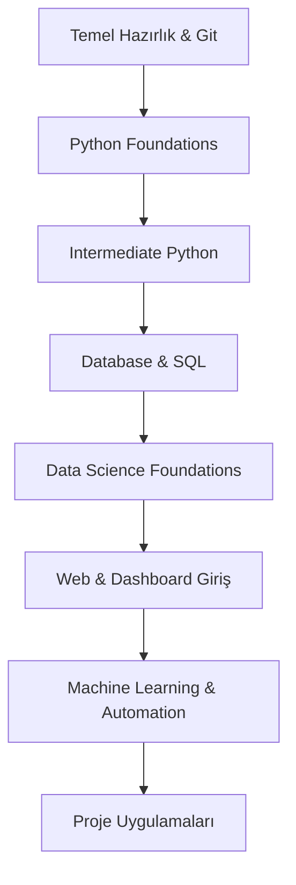

# 📈 Mevcut Öğrenme İlerlemesi ve Akış

Bu doküman, `python-library` klasöründeki mevcut çalışmalarının temelden bugüne olan mantıksal öğrenme sırasını gösterir.

---

## 🛤️ Öğrenme Yolu Akış Diyagramı

---

## 📂 Klasör Bazlı İlerleme Sırası

### 1. Adım: Temel Hazırlık ve Araçlar
*Geliştirme ortamı ve sürüm kontrolü.*
- `01_Temel_Hazirlik/Git_Basics`: Kod yönetimi temelleri.
- `01_Temel_Hazirlik/Shortcuts`: Verimlilik ve kısayollar.
- `01_Temel_Hazirlik/General_Review`: Genel tekrar notları.

### 2. Adım: Python Temelleri (Foundations)
*Programlamanın yapı taşları.*
- `02_Python_Temelleri/Variables_DataTypes` & `Strings`
- `02_Python_Temelleri/Conditionals_Operators`
- `02_Python_Temelleri/Collections` (Lists, Dicts, Sets)
- `02_Python_Temelleri/Loops_ErrorHandling`
- `02_Python_Temelleri/Functions`
- `Practice_Scripts`: İlk kodlama pratikleri.

### 3. Adım: İleri Seviye ve Modüler Python
*Profesyonel yapıya geçiş.*
- `03_Ileri_Seviye_Python/File_Operations`: Dosya okuma/yazma.
- `03_Ileri_Seviye_Python/Modules`: Kodun parçalara bölünmesi.
- `03_Ileri_Seviye_Python/OOP`: Nesne Yönelimli Programlama.
- `03_Ileri_Seviye_Python/Advanced_Python`: Decorators, Generators vb.

### 4. Adım: Veri Tabanı Dünyası
*Verinin saklanması ve sorgulanması.*
- `05_Web_ve_Veritabani/SQL_Database`
- `05_Web_ve_Veritabani/PostgreSQL_Intro`

### 5. Adım: Veri Bilimi ve Analitiği
*Veriden anlam çıkarma süreci.*
- `04_Veri_Bilimi_ve_Analiz/Data_Analysis` (Pandas & NumPy)
- `04_Veri_Bilimi_ve_Analiz/Advanced_Data_Analysis`
- `04_Veri_Bilimi_ve_Analiz/Faker_Data_Generation`: Sentetik veri üretimi.
- `04_Veri_Bilimi_ve_Analiz/Data_Visualization`: Matplotlib, Seaborn, Plotly.

### 6. Adım: Web ve Arayüz Geliştirme
*Uygulama ve servis seviyesi.*
- `05_Web_ve_Veritabani/FastAPI`: API geliştirme.
- `05_Web_ve_Veritabani/Django_Intro`: Web framework uzmanlığı.
- `05_Web_ve_Veritabani/Intro_Streamlit`: Veri uygulamaları arayüzü.

### 7. Adım: Yapay Zeka ve Otomasyon
*Model eğitimi ve tarayıcı otomasyonu.*
- `06_Yapay_Zeka_ve_Otomasyon/Intro_ScikitLearn`: ML dünyasına giriş.
- `06_Yapay_Zeka_ve_Otomasyon/ML_Algorithms`: Spesifik algoritmalar.
- `06_Yapay_Zeka_ve_Otomasyon/Selenium_Basics`: Web otomasyonu ve scraping.

---

## 🏆 Uygulanan Portfolyo Projeleri
Bu aşamaya kadar geliştirilen ana projeler (`07_Portfolyo_Projeleri/` altında):
- **Salary_Prediction_Project:** Maaş tahminleme modeli.
- **Devamsizlik_Risk_Analizi:** İstatistiki risk analizi projesi.
- **CoinMind:** Kripto veri analizi platformu.
- **Portfolio_Website:** Kişisel sunum sayfası.

